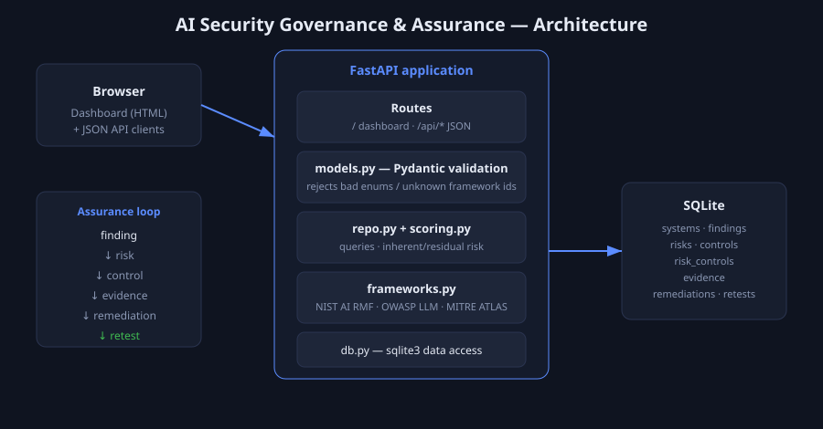

# AI Security Governance & Assurance

[](https://github.com/fidaaltf58/ai-security-governance-assurance/actions/workflows/ci.yml)
[](LICENSE)
[](pyproject.toml)

> An assurance platform that tracks AI systems, their risks, the controls that
> treat them, and the evidence that proves it — and closes the loop from a
> red-team finding all the way to a verified retest.



---

## 1. What is it

A web application for **governing the security of AI systems**. It maintains an
AI system inventory, a risk register with computed inherent/residual scores, a
control catalogue, a red-team findings log, and an evidence register — all
mapped to **NIST AI RMF**, the **NIST Generative AI Profile**, the
**OWASP Top 10 for LLM Applications (2025)**, and **MITRE ATLAS**. It exposes
both a JSON API and a server-rendered executive dashboard.

## 2. Why it exists

Organisations are deploying LLMs and other AI faster than they can govern them.
Red teams produce findings, but those findings often die in a slide deck: no one
tracks whether a finding became a risk, whether a control was actually
implemented, whether there's evidence, or whether a retest confirmed the fix.
This project implements that missing loop as auditable records:

```
finding → risk → control → evidence → remediation → retest
```

## 3. Tech stack

- **Python 3.10+**, **FastAPI**, **Uvicorn**
- **SQLite** via the standard-library `sqlite3` (explicit SQL, no ORM)
- **Pydantic v2** for request validation
- **Jinja2** server-rendered dashboard (no front-end build step)
- **pytest** + FastAPI `TestClient`, **ruff**, **pip-audit**, **gitleaks** in CI
- **Docker** / Docker Compose for one-command startup

## 4. Security frameworks it maps to

| Framework | How it's used |
|-----------|---------------|
| **NIST AI RMF 1.0** | Risks tagged to a function (GOVERN / MAP / MEASURE / MANAGE); controls derived from it |
| **NIST GenAI Profile (AI 600-1)** | Representative actions exposed via `/api/frameworks` |
| **OWASP LLM Top 10 (2025)** | Findings/risks tagged to `LLM01`…`LLM10`; dashboard shows coverage |
| **MITRE ATLAS** | Findings tagged to adversary techniques (e.g. `AML.T0051` prompt injection) |

Framework identifiers are validated on write, so a finding can't cite a category
that doesn't exist.

## 5. What I actually implemented

- A normalised **7-table schema** modelling the full assurance loop (see
  [`docs/data-model.md`](docs/data-model.md)).
- A **risk-scoring engine** (`app/scoring.py`): inherent = likelihood × impact on
  a 5×5 matrix; residual = inherent × (1 − aggregate control effectiveness),
  recomputed live from control implementation status.
- A **REST API** for systems, findings, risks, control mapping, and metrics,
  with Pydantic validation that rejects bad enums and unknown framework ids.
- An **executive dashboard**: KPI tiles, residual-risk distribution, top risks,
  and OWASP LLM coverage.
- A **framework reference module** kept in version control (no network calls).
- A **synthetic seed dataset** so the app is useful the moment it starts.
- **Tests, linting, dependency scanning and secret scanning** wired into CI.

## 6. Architecture

The diagram above shows the flow: browser/API client → FastAPI routes →
Pydantic validation → repository + scoring → `sqlite3` → SQLite. Framework
taxonomies live in `app/frameworks.py` and are referenced (by id) from the
database. Risk scores are **computed on read**, never stored, so they always
reflect current control state.

## 7. How to run it

**Docker (recommended):**
```bash
docker compose up --build
# open http://localhost:8000   (API docs at /docs)
```

**Local (Python 3.10+):**
```bash
python -m venv .venv && source .venv/Scripts/activate   # Windows Git Bash
#                                  source .venv/bin/activate on macOS/Linux
pip install -r requirements-dev.txt
uvicorn app.main:app --reload
# open http://localhost:8000
```

The database is created and seeded automatically on first request.

## 8. Results

- **Runs to a populated dashboard in one command** (`docker compose up`): 3
  seeded AI systems, 4 findings, 4 risks, 7 controls, with one finding carried
  through remediation to a passed retest.
- **Automated test suite: 37 tests passing** across scoring, framework
  integrity, control mapping, and the HTTP API (run `pytest`).
- **OWASP LLM coverage** surfaced on the dashboard: the seed data exercises
  LLM01, LLM06 and LLM07.
- **Live residual scoring:** mapping an `implemented` control to a risk measurably
  lowers its residual score (asserted in `tests/test_api.py`).

> The seed dataset is **synthetic and illustrative** — the numbers in it (e.g. a
> retest pass rate) describe the fictional demo org, not a real assessment.

## 9. Limitations

- No authentication/authorisation yet — intended for local/demo use behind a
  trusted boundary (see *Future work*).
- SQLite single-file store; fine for a team-scale register, not high-concurrency.
- The control catalogue and ATLAS/RMF data are a curated **subset**, not the
  full published frameworks.
- The dashboard is read-mostly; write operations are currently API-first.

## 10. What I learned

- Modelling a real governance workflow (finding→retest) as a relational schema,
  and why **derived risk scores** should be computed, not stored.
- Translating framework controls (NIST AI RMF, OWASP LLM Top 10) into data a
  system can validate against.
- Building a validation boundary with Pydantic so bad data is rejected at the
  edge, and testing an API end-to-end with FastAPI's `TestClient`.
- Wiring security into my own SDLC: lint + tests + dependency scan + secret scan
  on every push.

## Future work

- AuthN/AuthZ (OIDC) and per-role views.
- Optional React/Next front end consuming the existing JSON API.
- Postgres backend option; export of the register to CSV/JSON for auditors.
- Importers that ingest red-team tool output directly into the findings log.

## License

MIT — see [LICENSE](LICENSE). Security policy in [SECURITY.md](SECURITY.md).
